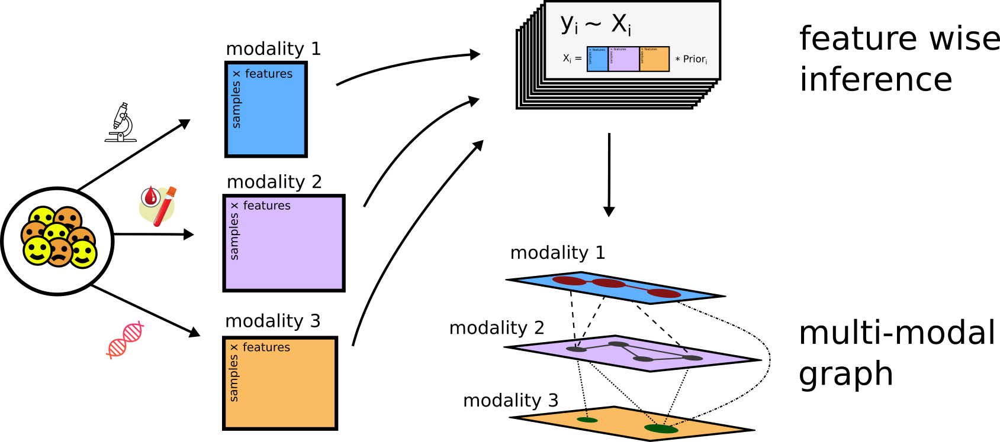

<br><br>

> This is a tutorial for multi-modal graph inference and analysis using the KiMONo framework ([Ogris et. al, 2021](https://www.nature.com/articles/s41598-021-85544-4)) on simluated transcriptomic, proteomic and phenotypic data. 


<center>{width='80%'}</center>
<br><br>

Graph inference from multimodal biological data sets of different measurement techniques has always been a big challenge in life sicience. KiMONo infers a multimodal graph by creating a sparse group lasso regression model for each feature. The method uses prior knowledge to pre-weight features. All trained models are then combined in a graph. Here nodes represent an individual input feature, like blood parameters, genes or proteins, and edges are modeled relations between them..


# Data
***

```{r, warning = FALSE,  message=FALSE}
library(kimono) 

#Visualization
library(ggplot2)
library(cowplot) 
library(DT)
```

## Mulit-modal data

* Rows represent samples
* Columns represent features

```{r, warning = FALSE}
phenotype <- fread("data/phenotype.csv")
head(phenotype)

transcriptome <- fread("data/expression.csv")
head(transcriptome)

proteome <- fread("data/proteome.csv")
head(proteome)
```

```{r, warning = FALSE}
# KiMONo relies on the fact that we feed it with matched samples. Meaning each row in each data type must represent the same sample.
# check if samples match
phenotype <- phenotype[match(transcriptome$sample, phenotype$sample),]
proteome <- proteome[match(transcriptome$sample, proteome$sample),]

# Dummy coding
# Character based variables must be either dummy coded or excluded
phenotype$z <- phenotype$z %>% as.factor %>% as.numeric

#finalize
input_layers <- list(
  'gene' = transcriptome[,-"sample"], 
  'protein' = proteome[,-"sample"],
  'phenotype' = phenotype[,-"sample"]
)

rm(transcriptome,phenotype,proteome) #free memory 

input_layers %>% str
```

> Note: list element lables must match prior label

## Prior data
***
KiMONo convert a simple csv based files to a prior network which suits us as an inference blueprint. Each row represents a pair of features which is **known** to be related. KiMONo uses the **igraph package** to efficiently incorporate the prior information and represent it as a network.

```{r, warning = FALSE}
gene_gene <- fread("data/mapping_expr.csv")
gene_gene %>% head
gene_proteome <- fread("data/mapping_expr_prot.csv")
gene_proteome %>% head

prior_network <- create_prior_network(rbind(gene_gene,gene_proteome)) ## prior network
prior_network
```

```{r, warning = FALSE}
vertex <- do.call(rbind,strsplit(V(prior_network)$name,split = '___'))

prior_network %>% plot(edge.curved=1,
     vertex.color = c("steel blue", "orange")[vertex[,1] %>% as.factor %>% as.numeric],
     vertex.frame.color="white",
     vertex.label = vertex[,2], 
     vertex.label.color='black',
     vertex.label.cex=.7,
     layout=layout_randomly, rescale=F) 
legend(x=-1.5, y=-1.1, c("Genes","Proteins"), pch=21,
       col="#777777", pt.bg=c("steel blue", "orange"), pt.cex=2, cex=.8, bty="n", ncol=1)
```

# KiMONo
***

Inference steps: 

1) Load the prior
2) Check if there arre layers without priors if so the algorithm will add each features to every model
3) Iterate over each data type 
4) Train a Sparse Group Lasso model for each node(target or y) in the prior network and determine the:
    * effects sizes of connected features (predictors)
    * r squared 
    * mse
5) Combine all models

<br><br>

Regression model:
\[\begin{aligned} y \sim X\beta + \epsilon \\		\end{aligned}\]
		
Sparse Group Lasso penalty:
\[  \frac{1}{2n} \Bigg|\Bigg| y - \sum_{l=1}^{m} X^{(l)} \beta^{(l)} \Bigg|\Bigg|_{2}^{2} + ( 1 - \alpha ) \lambda \sum_{l=1}^{m} \sqrt{p_{l}}\big|\big|\beta^{(l)}\big|\big|_2  + \alpha\lambda\big|\big|\beta \big|\big|_1 \]

## Call KiMONo
```{r, warning = FALSE}
network <- kimono(input_layers, prior_network ,core = 2)
```

## Output
<br>
Columns:

  * **target** - vector y in regression model
  * **predictor** - each feature in X used in model y
  * **value** - effect size of predictor on target
  * **r_squared** - model performance
  * **mse** - model error
  * **predictor_layer** - input data the predictor belongs to
  * **target_layer** - input data the target belongs to

<br>
```{r, warning = FALSE}
DT::datatable(head(network), class = 'cell-border stripe')
```


# Network Analysis
***

## Quality

Evaluating the r2 for each model gives us the possibility to compare the performances of our models.

> Note the rsquared is the same for each target.  

```{r, warning = FALSE}
gg_all <- network[predictor == '(Intercept)',] %>%  
            ggplot( aes(y=r_squared))  +
                    geom_boxplot()

gg_grouped <- network[predictor == '(Intercept)',] %>%  
            ggplot( aes(y=r_squared,x=target_layer))  +   
                    geom_boxplot(fill=c("steel blue",'#842F39', "orange"))

plot_grid(gg_all, gg_grouped, rel_widths = c(1, 2))


nnodes <- c(network$target, network$predictor) %>% unique %>% length
nedges <- dim(network)[1]

cat('Number of Nodes: ',nnodes)
cat('Number of Edges: ',nedges)
```


## Filter network 

Often we are only interested in models which perform well and have large effect sizes.
```{r, warning = FALSE}
network <- network %>% 
  filter(value > 0.001 | value < -0.001 ) %>% # filter low effects
  filter(r_squared > 0.001)  %>%  # filter low performing models
  filter(predictor != '(Intercept)') # filter all intercepts (should be close to 0 due to normalization step)
```

New network properties
```{r, warning = FALSE}
nnodes <- c(network$target, network$predictor) %>% unique %>% length
nedges <- dim(network)[1]

cat('Number of Nodes: ',nnodes)
cat('Number of Edges: ',nedges)
```

Generate igraph for easier network analysis
```{r, warning = FALSE}
#generate igraph
  ig_network <- network
    # often genes and proteins share names 
    # igraph requiers a unique ID
    # hence its getting a bit complicated
  ig_network$predictor <- paste0(network$predictor_layer,"___",network$predictor) 
  ig_network$target <- paste0(network$target_layer,"___",network$target)
  
  lable <- unique( c( ig_network$predictor, ig_network$target ) )
  nodes <- data.frame(id = lable, 
                      data_layer = do.call(rbind, strsplit(lable,"___") )[,1]
                       )
  
  ig <- graph_from_data_frame(ig_network, vertices=nodes, directed = TRUE)
```

Visualize network.
```{r, warning = FALSE}
vertex <- do.call(rbind,strsplit(V(ig)$name,split = '___'))
l <- layout_with_kk(ig)
plot(ig,
     edge.curved=0,
     vertex.color = c("steel blue",'#842F39', "orange")[vertex[,1] %>% as.factor %>% as.numeric],
     vertex.frame.color="white",
     vertex.label = vertex[,2], 
     vertex.label.color='black',
     vertex.label.cex=.7,
     layout=l,
     rescale=F
     ) 

 legend(x=-1.5, y=-1.1, c("Genes","Phenotype","Proteins"), pch=21,
     col="#777777", pt.bg=c("steel blue","#842F39", "orange"), pt.cex=2, cex=.8, bty="n", ncol=1)
     
```

## General
```{r, warning = FALSE}
cat('Density: ', ecount(ig)/(vcount(ig)*(vcount(ig)-1)), '\n' )
cat('Reciprocity: ', reciprocity(ig) , '\n' )
cat('Transitivity: ', transitivity(as.undirected(ig, mode="collapse")) , '\n' )
```


## Node degree and distribution
```{r, warning = FALSE}
deg <- degree(ig, mode="all")
cat('Average node degree: ', mean(deg), '\n' )

hist(deg, breaks=1:vcount(ig)-1, main="Histogram of node degree")

deg.dist <- degree_distribution(ig, cumulative=T, mode="all")

plot( x=0:max(deg), y=1-deg.dist, pch=19, cex=1.2, col="orange", 
      xlab="Degree", ylab="Cumulative Frequency")
```

## Hubs and authorities

Hubs were expected to contain catalogs with a large number of outgoing links....

```{r, warning = FALSE}

hs <- hub_score(ig, weights=NA)$vector


plot(ig,
     edge.curved=0,
     vertex.color = c("steel blue",'#842F39', "orange")[vertex[,1] %>% as.factor %>% as.numeric],
     vertex.frame.color="white",
     vertex.label = vertex[,2], 
     vertex.label.color='black',
     vertex.label.cex=.7,
     layout=l,
     rescale=F,
     vertex.size=hs*20, main="Hubs"
     ) 

 legend(x=-1.5, y=-1.1, c("Genes","Phenotype","Proteins"), pch=21,
     col="#777777", pt.bg=c("steel blue","#842F39", "orange"), pt.cex=2, cex=.8, bty="n", ncol=1)
 
```

...while authorities would get many incoming links from hubs

```{r, warning = FALSE}
as <- authority_score(ig, weights=NA)$vector
plot(ig,
     edge.curved=0,
     vertex.color = c("steel blue",'#842F39', "orange")[vertex[,1] %>% as.factor %>% as.numeric],
     vertex.frame.color="white",
     vertex.label = vertex[,2], 
     vertex.label.color='black',
     vertex.label.cex=.7,
     layout=l,
     rescale=F,
     vertex.size=as*20, main="Authorities"
     ) 

 legend(x=-1.5, y=-1.1, c("Genes","Phenotype","Proteins"), pch=21,
     col="#777777", pt.bg=c("steel blue","#842F39", "orange"), pt.cex=2, cex=.8, bty="n", ncol=1)
 


```


# Troubleshooting
***
## Installation

You can either install KiMONo locally by cloning the repository or using the devtools package.

### Github Installation

1. Install the devtools package and load it in R

```{r ,eval = FALSE }
install.packages("devtools")
library(devtools)
```

2. Install KiMONo in R and load the package
```{r , eval = FALSE }
install_github("cellmapslab/kimono")
library(kimono)
```

### Local Installation

1. In your terminal change the working directory to the location you want to install KiMONo 

2. Clone the repository: 
```{sh , eval = FALSE }
git clone https://github.com/cellmapslab/kimono.git
```

3. Install KiMONo in R and load the package 

```{r , eval = FALSE }
install.packages("yourpath/kimono/", repos = NULL, type = "source")
library(kimono)
```


## Dependencies CentOS
### oem
 CentOS needs a different version of RcppArmadillo(https://www.gitmemory.com/RcppCore)  
```{r , eval = FALSE }
 install.packages("RcppArmadillo", repos="https://rcppcore.github.io/drat")
```

# Session
***
```{r , eval = FALSE }
 sessionInfo()
```


